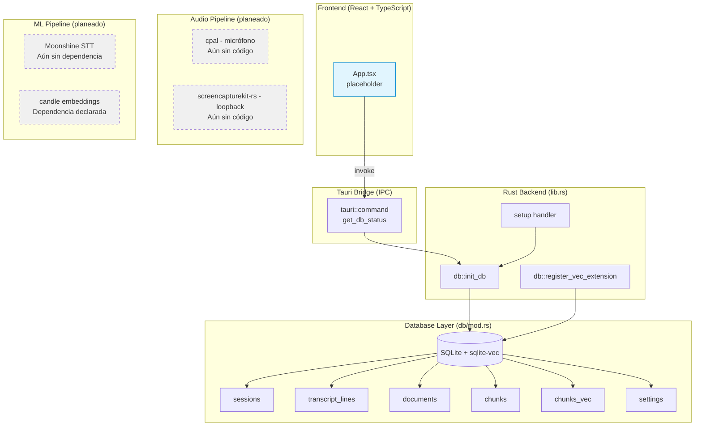

# Kue — Technical Design

> Estado actual: **Sprint 0** (infraestructura base). Este documento describe la arquitectura viva del proyecto, indicando qué partes están implementadas y cuáles son planeadas.

---

## 1. Arquitectura general



**Leyenda:** Trazo sólido = implementado. Trazo discontinuo = planeado/stub.

---

## 2. Layer breakdown

### 2.1 Frontend (`src/`)
- **`main.tsx`** — Entry point React 18, monta `<App />` en `#root`.
- **`App.tsx`** — Componente placeholder con un contador. Sin lógica de dominio aún.
- **`index.css`** — Directivas Tailwind (`@tailwind base/components/utilities`).

### 2.2 Tauri Shell (`lib.rs`)
Archivo `src-tauri/src/lib.rs` (19 líneas):

```
run() {
    db::register_vec_extension();   // Registra sqlite-vec antes que cualquier conexión
    tauri::Builder::default()
        .plugin(tauri_plugin_shell::init())
        .setup(|app| {
            let database = db::init_db(app);   // Crea ~/Library/.../kue.db + migra schema
            app.manage(database);               // Estado gestionado por Tauri
            Ok(())
        })
        .invoke_handler(tauri::generate_handler![db::get_db_status])
        .run(tauri::generate_context!())
}
```

- **plugin(tauri_plugin_shell)** — Necesario para invocar procesos externos (planeado para BYOK).
- **app.manage(database)** — Inyecta `Database` como estado accesible desde cualquier `#[tauri::command]`.

### 2.3 Database Module (`db/mod.rs`)
El módulo sustancial de la app (715 líneas, 20+ tests). Ver §3 para detalle del schema y §4 para tests.

### 2.4 Configuración
- **`tauri.conf.json`** — Tauri v2, ventana de 800×600, bundle DMG (solo macOS), dev URL en puerto 1420.
- **`vite.config.ts`** — Vite 6 con plugin React, HMR en puerto 1421, ignora cambios en `src-tauri/`.
- **`capabilities/default.json`** — Permisos: `core:default` + `shell:allow-open`.

---

## 3. Schema de base de datos

```sql
-- Sesiones de entrevista
CREATE TABLE sessions (
    id TEXT PRIMARY KEY DEFAULT (hex(randomblob(16))),
    started_at DATETIME DEFAULT CURRENT_TIMESTAMP,
    ended_at DATETIME,
    company TEXT,
    role TEXT,
    mode TEXT CHECK(mode IN ('practice', 'shadow'))
);

-- Líneas de transcripción por sesión
CREATE TABLE transcript_lines (
    id INTEGER PRIMARY KEY AUTOINCREMENT,
    session_id TEXT NOT NULL REFERENCES sessions(id),
    speaker TEXT CHECK(speaker IN ('user', 'interviewer')),
    text TEXT NOT NULL,
    started_at_ms INTEGER NOT NULL,
    ended_at_ms INTEGER NOT NULL
);

-- Documentos subidos por el usuario (CV, proyectos)
CREATE TABLE documents (
    id INTEGER PRIMARY KEY AUTOINCREMENT,
    filename TEXT NOT NULL,
    type TEXT NOT NULL,
    added_at DATETIME DEFAULT CURRENT_TIMESTAMP
);

-- Chunks de documentos con metadatos (tag + métrica)
CREATE TABLE chunks (
    id INTEGER PRIMARY KEY AUTOINCREMENT,
    document_id INTEGER NOT NULL REFERENCES documents(id),
    text TEXT NOT NULL,
    chunk_index INTEGER NOT NULL,
    tag TEXT,           -- ej. 'nestjs', 'redis', 'star'
    metric TEXT         -- ej. '10k req/seg', '40% reducción'
);

-- Índice vectorial (sqlite-vec)
CREATE VIRTUAL TABLE chunks_vec USING vec0(embedding float[384]);

-- Tabla clave-valor para settings (NO incluye API keys)
CREATE TABLE settings (
    key TEXT PRIMARY KEY,
    value TEXT NOT NULL
);
```

**Detalles de implementación:**
- WAL mode + foreign keys ON + busy timeout 5000ms.
- `chunks_vec` usa embedding de 384 dimensiones (`all-MiniLM-L6-v2`).
- La extensión `sqlite-vec` se registra vía `sqlite3_auto_extension` antes de abrir cualquier conexión.
- No hay ORM — consultas SQL directas vía `rusqlite`.

---

## 4. Datos de diseño

### 4.1 Conexiones concurrentes
`Database.conn` es `Mutex<Connection>` — un solo hilo accede a SQLite a la vez. La prueba `database_mutex_allows_concurrent_locks` verifica que dos threads pueden lockear secuencialmente y ver el mismo estado.

### 4.2 Manejo de errores
- `open_and_migrate` retorna `Result<Database, Box<dyn std::error::Error>>`.
- `get_db_status_inner` retorna `Result<DbStatus, String>` (errores planos para Tauri IPC).
- El mutex envenenado se maneja como error capturable (test `get_db_status_handles_poisoned_mutex`).

### 4.3 Idempotencia
Todas las DDL usan `IF NOT EXISTS`. El test `open_and_migrate_is_idempotent` corre la migración dos veces y verifica que las tablas no cambien.

---

## 5. Planeado vs implementado

| Componente | Estado | Dependencia en Cargo.toml | Código |
|---|---|---|---|
| DB schema + migraciones | **Implementado** | `rusqlite`, `sqlite-vec` | `db/mod.rs` |
| sqlite-vec register | **Implementado** | `sqlite-vec` | `db/mod.rs` |
| Tauri setup + comandos | **Implementado** | `tauri 2` | `lib.rs` |
| Frontend placeholder | **Implementado** | React 18 | `App.tsx` |
| Captura micrófono (cpal) | **Stub (dependencia declarada)** | `cpal` presente | Sin imports |
| Captura loopback (SCK) | **Stub (dependencia declarada)** | `screencapturekit` presente | Sin imports |
| Embeddings (candle) | **Stub (dependencia declarada)** | `candle-core`, `candle-transformers` presentes | Sin imports |
| STT (Moonshine) | **No iniciado** | No declarada | — |
| Clasificador de preguntas | **No iniciado** | — | — |
| Generador de hints | **No iniciado** | — | — |
| Overlay / UI real | **No iniciado** | — | — |
| Post-call BYOK | **No iniciado** | `tauri-plugin-shell` presente | — |

---

## 6. Patrones de diseño

- **Command pattern (Tauri):** `#[tauri::command]` como entry point de funcionalidad.
- **State management via Tauri:** `app.manage()` inyecta dependencias accesibles por estado.
- **Inner function pattern:** `get_db_status_inner` (testeable sin Tauri) separada de `get_db_status` (wrapper Tauri).
- **Once pattern:** `std::sync::Once` para registrar sqlite-vec una sola vez en tests.
- **Temporary directory isolation:** Cada test usa su propio directorio temporal (`TempDir` struct).

---

## 7. Dependencias externas

| Crate | Propósito | Versión |
|---|---|---|
| `tauri` | Shell de aplicación nativa | 2 |
| `tauri-plugin-shell` | Invocación de procesos externos (BYOK) | 2 |
| `rusqlite` | Cliente SQLite con bundled | 0.33 |
| `sqlite-vec` | Índice vectorial dentro de SQLite | 0.1.9 |
| `cpal` | Captura de audio por micrófono (stub) | 0.15 |
| `screencapturekit-rs` | Captura de loopback de sistema (stub) | git |
| `candle-core` | Framework ML para embeddings (stub) | 0.8 |
| `candle-transformers` | Modelos transformer (stub) | 0.8 |
| `hound` | Encoding/decoding WAV (stub) | 3.5 |
| `serde` / `serde_json` | Serialización IPC | 1 |
| `anyhow` / `thiserror` | Manejo de errores idiomático | 1 / 2 |
